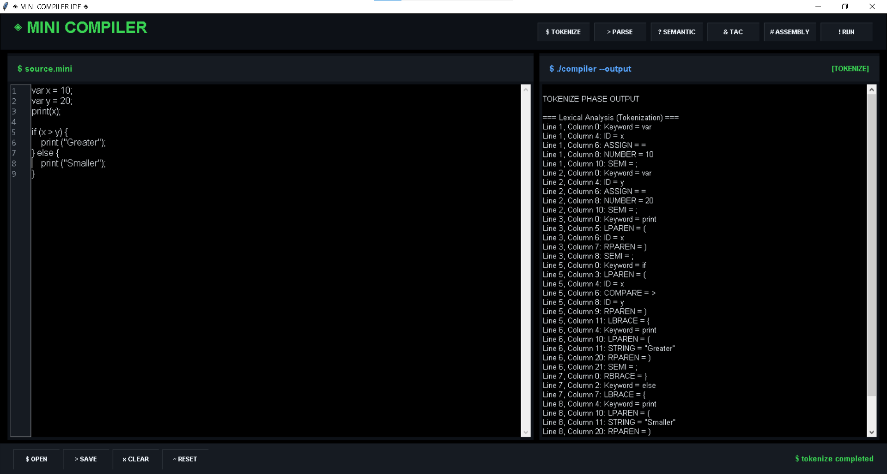

# ⚙️ Mini C Compiler  
[](https://opensource.org/licenses/MIT)  
[](https://isocpp.org)  
[](https://wiki.python.org/moin/TkInter)  

### PBL Compiler Construction Project

---

## 📌 Overview  
**Mini C Compiler** is a custom-built educational compiler developed using C++ for backend compilation and a Python GUI using Tkinter. It allows users to write, compile, and analyze code using custom uppercase keywords (like `IF`, `ELSE`, `PRINT`), demonstrating key compiler phases such as lexical analysis and parsing.

---

## 📽️ UI Preview  
  
*(Add your UI screenshot in the correct path)*

---

## 🚀 Features  
- 🖋️ Custom Syntax: Keywords like `IF`, `PRINT`, etc.  
- ⚙️ Lexical & Syntax Analysis using Flex and Bison or custom logic  
- 🧾 Multi-phase architecture (Lexer, Parser, Intermediate Code Gen...)  
- 🧠 Real-time feedback with syntax highlighting  
- 🖼️ GUI Editor built using Python Tkinter  
- 🧪 Run `.mini` files directly  
- 🔄 Cross-platform executable support (`.exe` and `.out`)

---

## 🏗️ Tech Stack  

| Layer | Tech |
|-------|------|
| **Frontend** | Python (Tkinter GUI) |
| **Backend** | C++ Compiler Logic |
| **Interfacing** | Subprocess module in Python |
| **Executable** | `mini_compiler.exe` / `mini_compiler` |
| **Lexer/Parser** | Optional: Flex/Bison or custom parsing |

---

## 📜 Problem Statement  
**Learning Compiler Design by Building One**  
Understanding compiler construction can be challenging. This project serves as a practical implementation of compiler phases and helps students grasp the fundamentals with a working demo.

---

## 🎯 Solution Approach  
- Implemented compiler logic in C++ with support for basic control and arithmetic expressions  
- Created a Python-based IDE using Tkinter with real-time line numbers and output console  
- Used subprocess module to compile and run `.mini` programs  
- Supports input through `.mini` files for testing  

---

## 🏗️ App   
  
*(Add architecture image if needed)*

---

## 📥 Installation & Usage  

### 🔧 1. Clone the repo
```bash
git clone https://github.com/Meraj-=8/compiler-project.git
cd mini-c-compiler
```

###⚙️ 2. Build the C++ Compiler
```bash
g++ -o mini_compiler mini_compiler.cpp
```

###🧪 3. Run the UI
```bash
python compiler_ui.py
```

##📂 File Structure
```bash
compiler/
├── mini_compiler.cpp        # Main compiler logic in C++
├── mini_compiler.exe        # Compiled binary (Windows)
├── compiler_ui.py           # Python Tkinter-based IDE
├── test.mini                # Sample test input
├── .vscode/                 # VSCode settings
└── README.md
```
##📄 Sample .mini Code
```bash
START
VAR A = 10;
VAR B = 20;
IF A < B THEN
    PRINT A;
ENDIF
END
```

## 🤝 Contributing

We welcome contributions! Feel free to submit pull requests or raise issues.

1. Fork the project  
2. Create your feature branch:  
   `git checkout -b feature/AmazingFeature`  
3. Commit your changes:  
   `git commit -m 'Add some AmazingFeature'`  
4. Push to the branch:  
   `git push origin feature/AmazingFeature`  
5. Open a Pull Request
